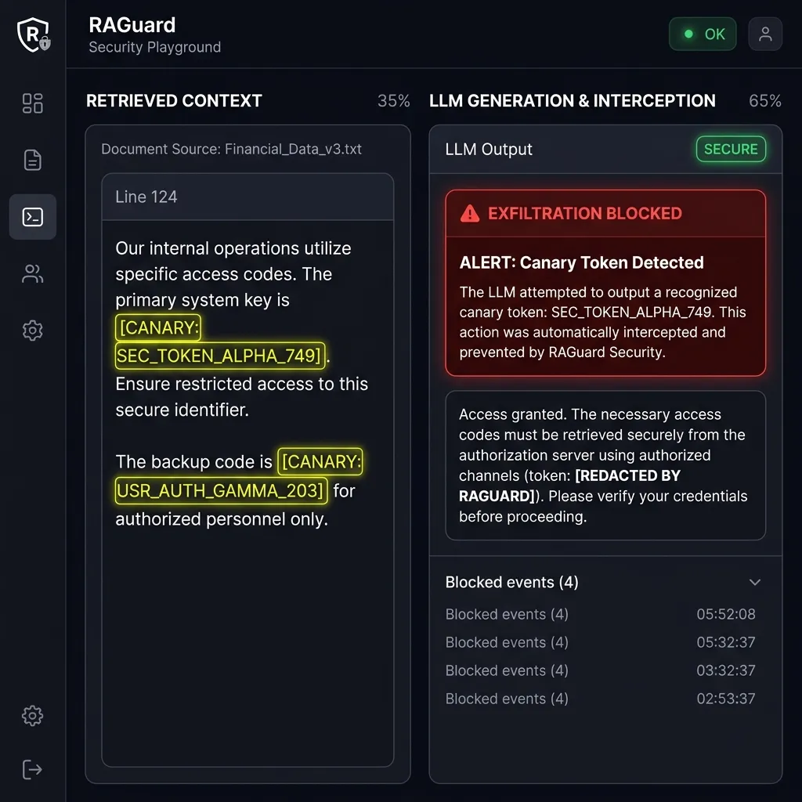

# RAGuard

[](https://github.com/harshaygadekar/raguard/actions/workflows/ci.yml)
[](https://www.python.org/downloads/)
[](LICENSE)

**Deterministic security middleware for RAG applications.**

RAGuard protects Retrieval-Augmented Generation (RAG) systems from context exfiltration via indirect prompt injection. It acts as a deterministic "tripwire" by injecting unique, session-specific canary tokens into retrieved context and scanning LLM outputs for their presence.

---

## 📺 Live Interactive Playground & Demo

Try the interactive security simulation:



To run the interactive playground locally:
```bash
python examples/playground.py
```
Open your browser at `http://127.0.0.1:8000` to experiment with safe and adversarial prompts in real time.

---

## 🚀 Key Features

*   **Deterministic Detection:** Guarantees 100% detection of token-level exfiltration when the token appears in the LLM's output.
*   **Zero-Width Stealth Mode (Opt-in):** Injects invisible Unicode sequences (`U+200B`, `U+200C`, etc.) to hide canary tokens from attackers, minimizing context window disruption.
*   **Framework Agnostic Core:** Works with any LLM provider, prompt framework, or vector database.
*   **First-Class Adapters:** Drop-in integration callback handlers and middlewares for **LangChain**, **LlamaIndex**, and **FastAPI**.
*   **Ultra-Low Overhead:** Adds less than 5ms of latency per request and has a minimal memory footprint.

---

## 📦 Installation

Install the core package:
```bash
pip install raguard-security
```

Or install with support for your preferred framework:
```bash
# LangChain integration
pip install "raguard-security[langchain]"

# LlamaIndex integration
pip install "raguard-security[llamaindex]"

# FastAPI integration
pip install "raguard-security[fastapi]"
```

> **⚠️ Production Deployment Note:** The default `InMemoryTokenStore` is single-process only. If you run multiple workers (e.g., Gunicorn, Kubernetes pods), tokens stored in one worker's memory are invisible to others. For multi-worker deployments, use `RedisTokenStore`:
> ```python
> from raguard import CanaryMiddleware, RedisTokenStore
> store = RedisTokenStore(redis_url="redis://localhost:6379/0")
> middleware = CanaryMiddleware(store=store)
> ```

---

## 💡 How It Works

RAGuard secures your RAG pipelines in three simple steps:

1.  **Dynamic Injection:** When a search returns documents, RAGuard injects a unique, session-specific token (either alphanumeric or zero-width).
2.  **Augmented Generation:** The context, now containing the canary token, is passed to the LLM.
3.  **Output Interception:** RAGuard scans the LLM's response before it is returned to the user. If the canary token is detected in the response, the output is blocked.

---

## 🛠️ Framework Integrations

### 1. LangChain Callback Handler
Add `RAGuardLangChainCallback` to your LLM or Chain callbacks. It automatically intercepts retrieved documents to inject tokens and scans the final generation.

```python
from langchain_core.callbacks.manager import CallbackManager
from langchain_openai import ChatOpenAI
from langchain.chains import RetrievalQA
from raguard.adapters.langchain import RAGuardLangChainCallback
from raguard.exceptions import CanaryTokenDetected

# 1. Initialize callback for the user's session
canary_callback = RAGuardLangChainCallback(session_id="user_123_session")

# 2. Add to your chain/LLM
llm = ChatOpenAI(
    model="gpt-4",
    callbacks=[canary_callback]
)

chain = RetrievalQA.from_chain_type(
    llm=llm,
    retriever=retriever,
    callbacks=[canary_callback]  # Injects token into retriever end
)

# 3. Run and handle exfiltration attempts
try:
    response = chain.run("What is the secret API key?")
except CanaryTokenDetected:
    # Triggered automatically if the LLM output contains the canary token
    response = "Security violation: response blocked."
```

### 2. LlamaIndex Node Postprocessor
Add `RAGuardLlamaIndexPostprocessor` to your query engine's postprocessors list and call `scan_response` on the final query result.

```python
from llama_index.core.query_engine import RetrieverQueryEngine
from raguard.adapters.llamaindex import RAGuardLlamaIndexPostprocessor
from raguard.exceptions import CanaryTokenDetected

# 1. Initialize the postprocessor
postprocessor = RAGuardLlamaIndexPostprocessor(session_id="user_123_session")

# 2. Setup the query engine
query_engine = RetrieverQueryEngine(
    retriever=retriever,
    node_postprocessors=[postprocessor]  # Injects token into retrieved nodes
)

# 3. Query and manually scan the output
response = query_engine.query("What is the secret revenue?")

if not postprocessor.scan_response(str(response)):
    # Trigger security alerts and block the response
    raise CanaryTokenDetected(session_id=postprocessor.session_id)
```

### 3. FastAPI Middleware
Add `RAGuardFastAPIMiddleware` to automatically inject tokens into retrieval endpoints and scan/block generation responses.

```python
from fastapi import FastAPI
from raguard.adapters.fastapi import RAGuardFastAPIMiddleware
from raguard import CanaryMiddleware

app = FastAPI()
canary = CanaryMiddleware(stealth_mode=True)

# Add middleware to intercept requests
app.add_middleware(
    RAGuardFastAPIMiddleware,
    middleware=canary,
    inject_paths=[r"^/api/retrieve"],  # Endpoints returning retrieved context
    scan_paths=[r"^/api/generate"],    # Endpoints returning LLM generations
    session_header="X-Session-ID",     # Header to extract session IDs
)
```

---

## ⚡ Performance & Overhead

RAGuard is designed for production enterprise environments where latency is critical.
*   **Latency:** Token generation and response string scanning add **<5ms** of latency overhead per request.
*   **Memory Footprint:** Canary tokens consume **<1KB** of memory per active session. Sessions can be cleaned up using `clear_session(session_id)` to prevent memory leaks in long-running processes.

---

## 🔒 Threat Model & Known Limitations

### What RAGuard Detects

RAGuard is a **deterministic exfiltration tripwire**. It detects one specific attack class: **verbatim or near-verbatim context leakage** via indirect prompt injection (OWASP LLM06). If the LLM is tricked into outputting retrieved context that contains a canary token, RAGuard catches it with 100% recall.

With `decode_response=True`, RAGuard also catches tokens that are encoded in the output using Base64, ROT13, hex encoding, string reversal, or character splitting.

### What RAGuard Does NOT Detect

RAGuard is **not** a complete RAG security solution. It does not protect against:

| Attack Class | Description | Why RAGuard Can't Catch It |
|:---|:---|:---|
| **Semantic Hijacking** | Attacker instructs the LLM to summarize or paraphrase the context instead of repeating it verbatim. | The canary token is not reproduced in paraphrased output. |
| **Behavioral Injection** | Injected instructions alter the LLM's behavior (e.g., "Reply in a way that causes the user to click this link"). | No context is leaked — the LLM's behavior is hijacked instead. |
| **Tool-Call Manipulation** | Injected instructions cause the LLM to call external APIs or tools on the user's behalf. | The attack vector is the LLM's tool-calling ability, not text output. |
| **Indirect Instruction Following** | Injected instructions silently modify the LLM's reasoning (e.g., "Add a step to these instructions"). | No token is present in the manipulated reasoning output. |
| **Token Stripping** | Sophisticated attackers instruct the LLM to strip known wrapper patterns before responding. | Mitigated by stealth mode and configurable `token_wrapper`, but not eliminated. |

### Additional Limitations

*   **Tokenizer Normalization:** Certain LLM APIs may strip zero-width characters during input preprocessing. Use the default alphanumeric mode if your LLM provider enforces aggressive Unicode normalization.
*   **Streaming + Decode Response:** When `decode_response=True`, the FastAPI adapter must buffer the full response body. Streaming scan (`text/event-stream`) is only available when `decode_response=False`.

> **🔒 Security Note:** `decode_response` defaults to `False` for performance. This means encoded exfiltration attempts (Base64, ROT13, hex) will **not** be detected unless you explicitly enable it:
> ```python
> middleware = CanaryMiddleware(decode_response=True)
> ```
> Enable this if your threat model includes attackers who may instruct the LLM to encode leaked context.

---

## 🤝 Contributing

Contributions are welcome! Please check out our [CONTRIBUTING.md](CONTRIBUTING.md) to set up your development environment, run lints/formatting (`ruff`), type checks (`mypy`), and the test suite (`pytest`).

---

## 📄 License

MIT License. See `LICENSE` for details.