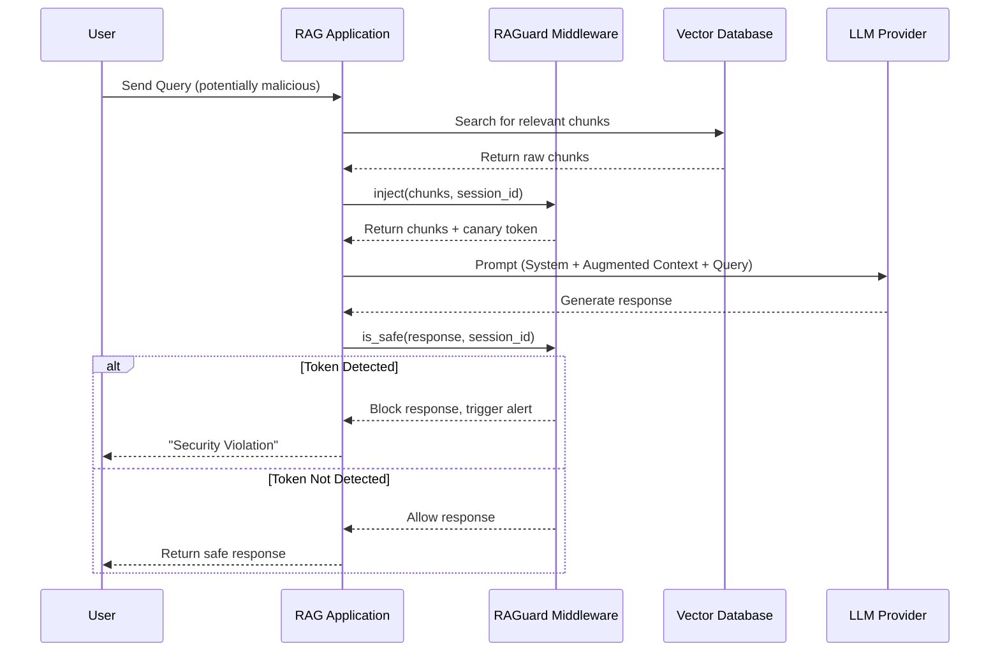

# RAGuard System Architecture

## Overview
RAGuard is designed with a strict separation of concerns: a framework-agnostic **Core Engine** handles the cryptographic logic, while lightweight **Adapters** bridge the core to specific RAG frameworks (LangChain, LlamaIndex, FastAPI).

## Core Components

1. **Token Generator**: Creates cryptographically secure random strings (alphanumeric) or zero-width Unicode sequences per session.
2. **Context Injector**: Appends the token to the retrieved text chunks without altering their semantic meaning.
3. **Output Scanner**: Performs a fast, deterministic regex or string match on the LLM's final output before it reaches the user.

## Architecture Diagram

## Adapter Pattern
Adapters do not contain business logic. They simply hook into the lifecycle events of their respective frameworks:
- **LangChain**: Implements `BaseCallbackHandler` (`on_retriever_end`, `on_llm_end`).
- **LlamaIndex**: Implements `NodePostprocessor` (modifies nodes pre-LLM) and a custom output parser.
- **FastAPI**: Implements standard `BaseHTTPMiddleware` to wrap the entire chat endpoint.