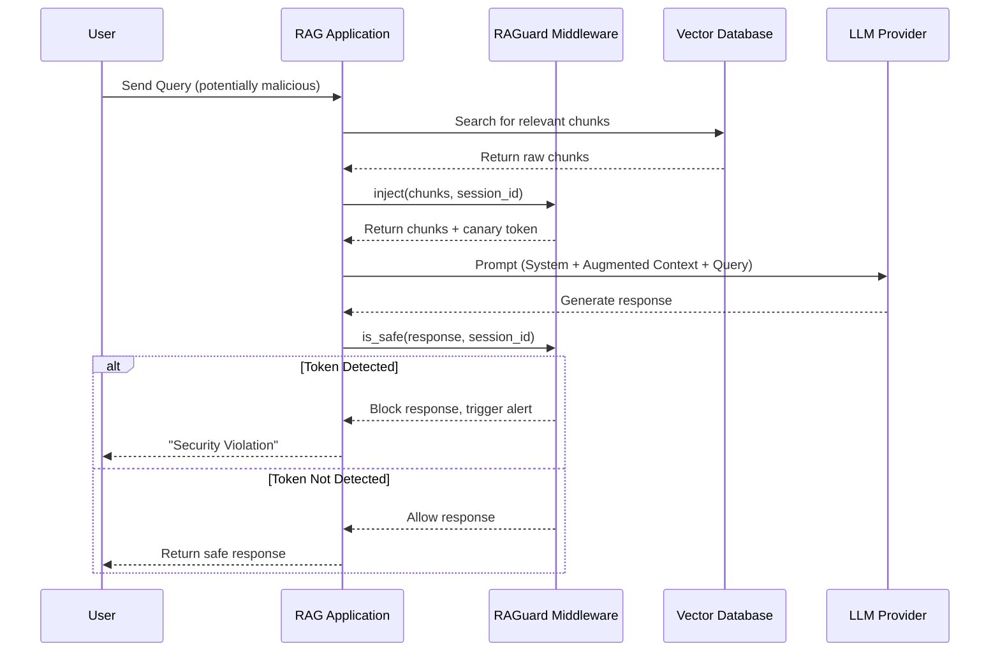

# RAGuard System Architecture

## Overview
RAGuard is designed with a strict separation of concerns: a framework-agnostic **Core Engine** handles the cryptographic logic, while lightweight **Adapters** bridge the core to specific RAG frameworks (LangChain, LlamaIndex, FastAPI).

## Core Components

1. **Token Generator**: Creates cryptographically secure random strings (alphanumeric) or zero-width Unicode sequences per session, via `CanaryMiddleware.generate_token()`.
2. **Context Injector**: Appends or prepends the token (wrapped via `token_wrapper`) to retrieved text chunks without altering their semantic meaning, via `CanaryMiddleware.inject()` / `inject_async()`.
3. **Output Scanner**: Performs a fast, deterministic substring match on the LLM's final output before it reaches the user, via `CanaryMiddleware.is_safe()` / `is_safe_async()`. With `decode_response=True`, the scanner also decodes Base64, ROT13, hex, reversed, and character-split variants before matching, to catch encoded exfiltration.
4. **Token Store**: A pluggable storage seam (`TokenStore` protocol) that holds per-session active tokens. Two implementations ship:
   - `InMemoryTokenStore` — single-process, thread-safe, with TTL eviction, FIFO pruning, an optional `max_sessions` cap, and a background daemon sweep thread. Used by default.
   - `RedisTokenStore` — backed by Redis sorted sets (`ZADD`/`ZRANGE`) with native key TTL and FIFO eviction; for multi-worker / horizontally scaled deployments. Installed via the `raguard[redis]` extra.
5. **Alerting & Resilience**: On detection, an optional webhook is fired (stdlib `urllib`, fire-and-forget, 5s timeout). The webhook subsystem applies an SSRF filter on the target URL (blocking loopback/private IP literals — see README threat model for its scope) and a threshold-based circuit breaker that stops delivery attempts when the webhook host is unresponsive. A `fail_open` toggle controls whether store errors propagate or degrade gracefully.
6. **Observability**: A thread-safe `RAGuardMetrics` counter records tokens generated, tokens detected, responses scanned, and webhook outcomes.

## Configuration

All runtime knobs are centralized in `RAGuardConfig` (a Pydantic `BaseSettings` model), covering stealth mode, token length and wrapper, injection position, decode behavior, store limits, webhook settings, circuit-breaker thresholds, the `fail_open` policy, and the FastAPI `max_scan_body_bytes` cap. Every field is overridable via environment variables with the `RAGUARD_` prefix (e.g. `RAGUARD_STEALTH_MODE=true`).

## Architecture Diagram

## Adapter Pattern
Adapters do not contain business logic. They simply hook into the lifecycle events of their respective frameworks:
- **LangChain**: Implements `BaseCallbackHandler` (`on_retriever_end` to inject, `on_llm_end` / `on_chain_end` to scan). Raises `CanaryTokenDetected` on exfiltration. Supports both `langchain_core` and legacy `langchain` import paths.
- **LlamaIndex**: Implements `BaseNodePostprocessor` (modifies nodes pre-LLM). Because LlamaIndex lacks an output-interception hook, callers must manually run `scan_response()` on the final generation to enforce detection.
- **FastAPI**: Implements standard `BaseHTTPMiddleware`, configured with regex `inject_paths` and `scan_paths`. Injects tokens into JSON retrieval bodies (recursing into nested dicts and lists) and scans generation bodies. For `text/event-stream` responses it runs a sliding-window chunk scanner that forwards chunks as they arrive while catching tokens that span chunk boundaries; when `decode_response=True` (which needs the full text) it buffers the body instead. A `max_scan_body_bytes` cap (default 1 MB) rejects oversized generation bodies without scanning to protect the process from OOM.